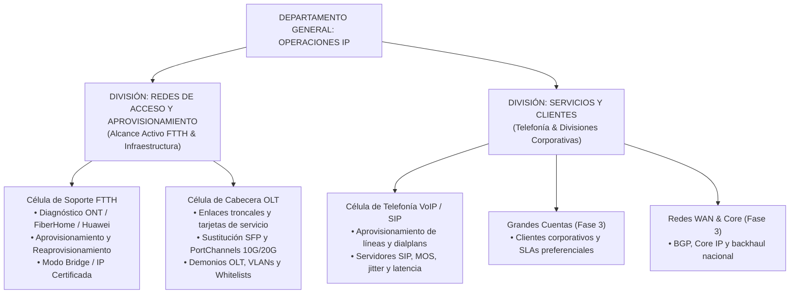
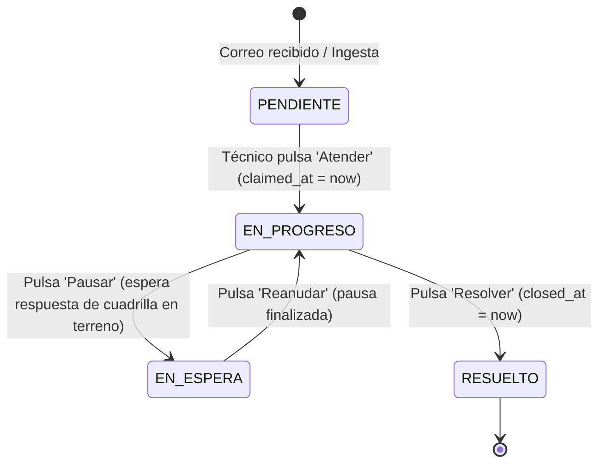

# Contexto General del Proyecto: Portal de Operaciones IP
**Plataforma de Gestión de Carga Operativa, Métricas DERS y Automatización FSM**  
*Inter Telecomunicaciones C.A. — Red FTTH*

---

## 1. Misión y Filosofía Central

El objetivo principal de esta plataforma es **hacer visible y medible la carga de trabajo real del departamento de Operaciones IP** (red GPON/FTTH de Inter Telecomunicaciones C.A.), proporcionando métricas de productividad, saturación y balance de turnos basadas en datos objetivos.

### Regla de Oro Operacional (Cero Fricción)
> **El sistema NO debe alterar ni entorpecer el flujo de trabajo actual de los ingenieros y cuadrillas de campo.**
> Toda la información de casos de soporte e incidencias ya fluye a través del correo corporativo. Por lo tanto, el sistema se acopla como una capa inteligente que lee, analiza, cronometra y pondera los casos de forma desatendida, eliminando al 100% el ingreso manual de tiempos o el llenado burocrático de formularios.

---

## 2. Estructura Jerárquica y Células de Trabajo

La plataforma refleja la organización real de la empresa y soporta dotación dinámica de personal:

---

## 3. Ingesta Automatizada y Algoritmo de Extracción Telco

### Ingesta de Correo (IMAP / Simulador)
1. **Worker Desatendido:** Conexión continua a servidor corporativo vía IMAP SSL (puerto 993) para leer correos entrantes de soporte (`UNSEEN`).
2. **Idempotencia Absoluta:** Control estricto de duplicados mediante cabecera RFC 2822 `Message-ID`.
3. **Simulador de Laboratorio:** Generador sintético de casos para pruebas locales sin conexión a internet ni consumo de APIs de pago.

### Especificaciones de Sintaxis y Entidades Técnicas (`TelcoEmailParser`)
El procesador heurístico/determinista analiza el cuerpo de los correos y extrae los datos clave según los estándares operativos de Inter:
- **Número de Abonado (10 Dígitos):** Extrae el código de cliente/contrato. Los **2 primeros dígitos identifican el Permisor** (área geográfica que puede abarcar múltiples ciudades; ej. `P-10`, `P-25`).
- **Serial PON (12 Caracteres):** Identifica tecnología y fabricante del equipo ONU/ONT:
  - `FHTT...`: FiberHome (Red nativa de Inter).
  - `HWTC...`: Huawei (Red Netuno / Inter).
  - `STV...` / Otros: SimpleTV / Terceros.
- **Formato Canónico de OLT:** Normaliza variantes en texto libre a la sintaxis estándar:  
  `OLT - [3-4 Letras Acrónimo Ciudad] - [Número]` (ej. `OLT-CCS-01`, `OLT-VAL-02`).
- **Ubicación en OLT (Slot/PON):** Rara vez se envía en el correo; el sistema asigna por defecto: *"Consultar en OLT vía Serial PON"*.
- **Dirección MAC:** Generalmente opcional (se opera por Serial PON), pero el parser la extrae si el técnico la provee.
- **Alerta de Seguridad Crítica en Modo Bridge / IP Certificada:**
  - Cuando el parser detecta peticiones de modo bridge o IP fija sin plantilla predeterminada, activa de forma mandatoria una **alerta visual roja que prohíbe comandos de refresco o reaprovisionamiento**, previniendo la degradación del servicio del cliente.

---

## 4. Sistema de Ponderación por Complejidad (Catálogo DERS)

Para medir el esfuerzo de forma justa y no simplemente por volumen bruto de tickets, la plataforma utiliza el estándar de complejidad DERS (P1 a P5):

| Nivel | Puntos | Complejidad | Ejemplos Típicos de Tareas |
| :---: | :---: | :--- | :--- |
| **P1** | **1 pt** | Muy Baja | Verificación de estado de ONT en OLT, consultas informativas simples. |
| **P2** | **2 pts** | Baja | Resolución de discrepancia MAC, pruebas de velocidad, validación de drop. |
| **P3** | **3 pts** | Media | Desatasco de demonio OLT (VLAN / Whitelist), sustitución física de SFP. |
| **P4** | **5 pts** | Alta | Soporte a Modo Bridge con IP Certificada, análisis de Jitter & MOS VoIP. |
| **P5** | **8 pts** | Crítica | Habilitación PortChannel 10G/20G, contingencias en enlaces troncales OLT. |

### Medición de Balance y Saturación
- El sistema calcula dinámicamente la saturación del área y de cada especialista activo en tiempo real:
  - **Saturación Equilibrada:** $\le 25$ puntos por especialista.
  - **Saturación Moderada:** $26 - 45$ puntos por especialista.
  - **Saturación Alta / Alerta:** $> 45$ puntos (indica cuello de botella o sobrecarga de turno).

---

## 5. Ciclo de Vida FSM y Cronometraje 100% Automatizado

El sistema opera bajo una Máquina de Estados Finitos (FSM) que registra marcas temporales exactas:

### Reglas del Cronómetro:
1. **Bloqueo Concurrente:** Al reclamar un ticket, queda bloqueado por el especialista actual para evitar duplicidad.
2. **Cálculo de MTTR Neto:**
   $$\text{MTTR Neto} = (\text{closed\_at} - \text{claimed\_at}) - \sum \text{tiempos\_en\_espera}$$
   El tiempo que la cuadrilla de terreno tarda en verificar acometida o fibra física **no penaliza** las métricas del especialista de Operaciones IP.

---

## 6. Roles y Logística Operativa

### Rol Coordinador / Supervisor
- Supervisa la cola global de tickets de su área.
- Asigna tareas directamente a especialistas o las deja disponibles en la bolsa común para que sean tomadas según prioridad.
- Puede ajustar o convalidar a criterio técnico la ponderación DERS (P1-P5).
- Monitorea velocímetros de saturación y balance de turnos.
- Descarga reportes de auditoría forense en Excel (`.xlsx`).

### Rol Operador / Especialista
- Visualiza su cola de trabajo en una interfaz dividida estilo Microsoft 365 / Outlook.
- Reclama tickets (`Atender`), pausando si requiere apoyo de terreno y resolviendo cuando finaliza el diagnóstico.
- Visualiza su puntaje acumulado y progreso de turno sin intervención burocrática.

---

## 7. Reportes Gerenciales y Auditoría Forense

Exportación en un solo clic a Excel profesional (`openpyxl`) con tres hojas estructuradas:
1. **Resumen Ejecutivo y Células:** KPIs consolidados, horas hombre, distribución porcentual y semáforo de saturación.
2. **Productividad de Especialistas:** Detalle por analista con volumen de casos, puntos DERS acumulados, MTTR promedio y desglose P1 a P5.
3. **Log Detallado de Auditoría:** Trazabilidad forense ticket por ticket (fechas, tiempos brutos y netos, pausas, abonado, permisor, serial PON, OLT, MAC y notas de cierre).

---

## 8. Diseño y Experiencia de Usuario (UI/UX)

- **Nombre del Sistema de Diseño:** *Telecom Precision Analytics*.
- **Inspiración Estética:** Corporate Modern con glassmorphism sutil inspirado en macOS (fondos slate suaves `#F3F6FC`, tarjetas blancas `#FFFFFF`, bordes sutiles `1px`, desenfoque de fondo y acentos corporativos en azul Inter `#1C58A8` y navy `#0B3B78`).
- **Paleta Semántica Rigurosa:**
  - Azul = Normal / Operativo.
  - Amarillo / Ámbar = Atención / Moderado / En espera.
  - Azul Marino Oscuro / Vermilion = Alto / Crítico / P1.
- **Tipografía:** Sistema nativo con soporte estricto de `tabular-nums` para alineación perfecta de códigos y números de ticket.
- **Soporte Tema Claro y Oscuro:** Persistencia en `localStorage` con tokens simétricos (`data-theme="dark"`).